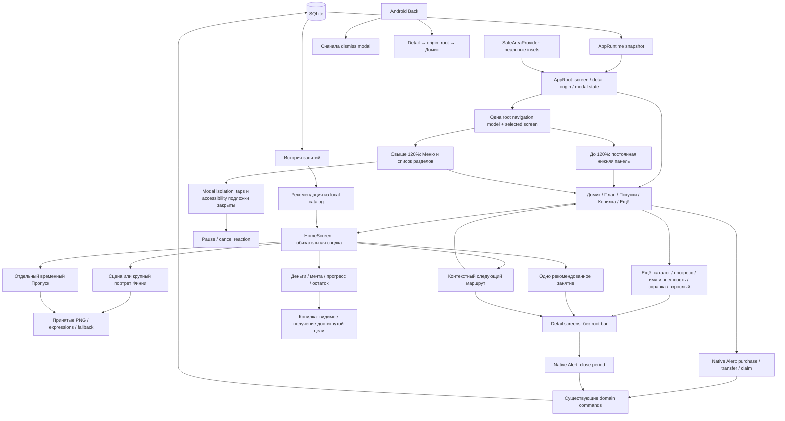

# S9-001: общая навигация и Home

Актуальная структура: DEC-2026-09-25-013, уточнение постоянной навигации.

Home и общая панель только открывают маршруты. Финансовое подтверждение выполняется внутри существующего экрана; панель не показывается поверх native Alert. Подписанные вкладки постоянны на пяти roots и отражают текущий экран; в крупном режиме используется тот же набор IDs списком. Незавершённая анимация не заменяет меню действием пропуска.

Обязательная сводка остаётся одновременно видна в 360×640/200%. CLOSED проверяется как presentation state; сохранённый закрытый период lifecycle проецирует в READY/WAITING. Новые bitmap assets и изменение экономики не требуются.
