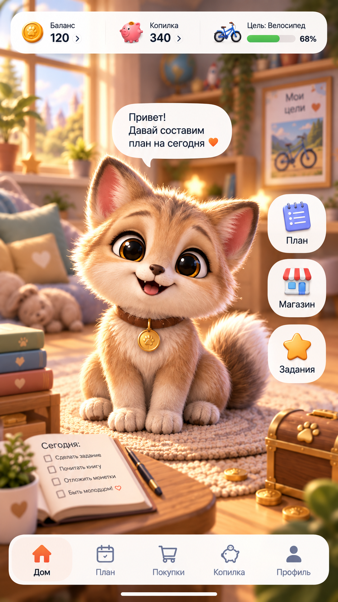

# Питомец Финни
## Дополнение к ТЗ: 3D-визуал, персонаж, комната и анимации

**Версия:** 1.0 · **Дата:** 18 сентября 2026 года\
**Назначение:** постановка работ для дизайнера, 3D-художника, аниматора, разработчика и тестировщика.\
**Статус:** художественное направление и последний концепт утверждены пользователем; нижеследующая техническая и интерфейсная детализация — проект дополнения на согласование. Это не отчёт о выполненной реализации.

> **Результат:** одна качественная 3D-комната, один полнофигурный хорошо анимированный Финни, несколько интерактивных предметов и фиксированная основная камера. Ребёнок сначала замечает питомца, затем доступные действия и только потом рассматривает комнату. Финансовые данные остаются точными, крупными и читаемыми.

## 1. Основание, границы и приоритет требований

### 1.1. Использованные материалы

**[S1] Конкурсное ТЗ** — «ТЗ_Департамент финансов города Москвы.pdf», 17 страниц. В ссылках ниже указаны разделы и номера страниц PDF, считая обложку первой; печатная нумерация документа на единицу меньше.

**[S2] Согласование в текущей переписке** — переход от простого интерфейса к настоящему мягкому стилизованному 3D; утверждение одной комнаты, одного питомца и фиксированной камеры; удаление декоративных надписей; увеличение визуального акцента на Финни; принятие последнего изображения словами «то что надо».

**[S3] Утверждённое изображение** — `reference/finni-home-approved.png`, точная копия файла «уютный_питомец_в_детском_приложении.png». Это художественный эталон, не готовая 3D-сцена и не окончательная спецификация навигации.

**[S4] Срез реализации** — предоставленный архив `Finni-App-dev.zip`: `package.json`, `app.json`, `README.md`, `docs/environment.md`, `src/domain/`, `src/application/`, `src/persistence/`, `src/ui/`, `fixtures/economy-v2.json`, `content/bootstrap-content.json`. Проверены исходники, но в рамках подготовки дополнения не выполнялись сборка APK, запуск на телефоне и замеры.

**[S5] Предыдущий визуальный аудит** — `Finni_Visual_Audit_and_Redesign_Plan.md`. Используется как перечень обнаруженных проблем, но его раннее предложение рисованной 2.5D-графики заменено более поздним решением [S2].

Полный файл совместного функционального ТЗ v1.3 в предоставленном архиве отсутствует и в доступных файлах не найден. Поэтому здесь не заявляется построчная сверка с ним: экономические инварианты проверены по [S4], обязательные требования — по [S1], художественные решения — по [S2–S3]. При включении дополнения в основной комплект следует сопоставить идентификаторы требований и точный каталог контента, не переписывая их по памяти.

### 1.2. Как читать требования

Пометка **«Сохранить»** означает требование источника либо уже согласованное решение. Пометка **«Ввести»** означает предлагаемую детализацию этого дополнения. После согласования она становится критерием реализации. **«Ориентир»** — стартовое числовое значение для макетирования или испытаний, а не измеренный результат и не установленный организатором норматив.

Идентификаторы `VIS`, `PET`, `ROOM`, `HUD`, `INT`, `AN`, `EVT`, `TECH`, `PERF`, `QA` нужны для задач и проверки. Их нельзя показывать в детском интерфейсе.

### 1.3. Что дополнение меняет и чего не меняет

**Сохранить.** Обучение через самостоятельные решения, план и факт, обязательные и необязательные покупки, накопления, задания, историю, развитие питомца, взрослый раздел, локальный профиль и демонстрационный режим. Конкурсный минимум: 9 комбинаций внешности, 5 последовательных периодов, 6 заданий по 3 темам, 8 покупок двух типов, 3 цели и 3 стадии развития. Основание: [S1, §2.5–2.6, PDF с. 5–8].

Сохраняются ранее выбранные дополнительные направления: финансовый детектив, компактная мастерская возможностей и необязательные семейные карточки «Финни вне экрана». Это дополнение определяет общий визуальный язык, но не расширяет их механику, правила наград или перечень задач.

**Ввести.** Настоящую 3D-сцену домика, модель и анимационный набор Финни, систему интерактивных предметов, новый визуальный слой экранов, производственный комплект ресурсов и проверку художественного качества на Android.

Не входят в эту работу: свободное перемещение игрока, вращение камеры жестами, открытый мир, новые комнаты, несколько питомцев одновременно, редактор мебели, новая валюта, магазин внешности, случайные сундуки, социальные механики и генерация контента во время игры. Такие возможности не следуют из утверждения визуального концепта.

### 1.4. Разрешение противоречий

При конфликте художественного изображения с обязательной функциональностью действует [S1] и согласованная игровая логика. При конфликте раннего визуального предложения с последним согласованием действует [S2–S3]. В этой работе нельзя незаметно менять экономику, этапы цикла или минимальную версию Android ради удобства графической библиотеки.

## 2. Утверждённый визуальный эталон

**Рисунок 1.** Утверждены образ, степень проработки, настроение сцены и приоритет питомца. Надписи и числа изображения не являются тестовыми данными приложения.

### 2.1. Что необходимо сохранить

**VIS-001 · Сохранить.** Крупный рыже-кремовый пушистый Финни с полноценным телом, большими выразительными глазами, лапами и хвостом. Питомец расположен на коврике, воспринимается главным героем и не выглядит отдельной наклейкой поверх комнаты.

**VIS-002 · Сохранить.** Тёплое освещение из окна, мягкая контактная тень, согласованные материалы шерсти, ткани, дерева, бумаги и металла. Объём создаётся формой и светом, а не обводкой или одинаковым глянцем всех поверхностей.

**VIS-003 · Сохранить.** Окружение вторично: спокойнее по деталям и контрасту, с визуальным отделением от питомца. Общее впечатление мягко расфокусированного дальнего плана сохраняется, но конкретная техника достижения этого эффекта выбирается после проверки на устройстве.

**VIS-004 · Сохранить.** Декоративные тексты на книгах, подушках, горшках, сундуке и дополнительных постерах отсутствуют. Планер и цель могут содержать смысловой текст, связанный с действительными данными приложения.

### 2.2. Что нельзя копировать из картинки буквально

| Элемент концепта | Правило реализации |
|---|---|
| Баланс 120, накопления 340, велосипед и 68% | Только пример оформления. Подставлять текущие данные профиля; велосипед не добавляется в каталог автоматически |
| Кнопки справа и повторение тех же разделов снизу | Не обязательная схема навигации. Предложение по компактной навигации — в §6 |
| Свинка в счётчике и сундук в комнате | Ввести единый образ накоплений: основной знак — миниатюра нашего сундука; отдельную вторую копилку не создавать |
| «Быть молодцом!» в ежедневнике | Не переносить. Заменить реальным действием без оценки личности ребёнка |
| Постоянное «Давай составим план» | Реплика зависит от этапа. После подтверждения плана она не должна оставаться призывом к уже выполненному действию |
| Отсутствие явных показателей состояния и активного задания | Добавить предусмотренную ТЗ сводку; настроение нельзя передавать только улыбкой |
| Системная полоска жестов внизу | Не включать в ресурс сцены. Системные области формирует Android |
| Подробная шерсть в сгенерированном кадре | Эталон мягкости и характера, не требование рассчитывать каждый волосок в реальном времени |

**VIS-005 · Ввести.** Финальная сцена оценивается в масштабе реального телефона, в движении и вместе с интерфейсом. Красивый отдельный рендер персонажа не заменяет приёмку экрана.

## 3. Композиция, свет и визуальная тишина

### 3.1. Приоритеты сцены

**VIS-006 · Ввести.** В стандартном домашнем состоянии лицо и силуэт Финни имеют наиболее выразительную детализацию среди объектов мира. Яркое окно, металл сундука и лампы не должны перетягивать внимание. Подтверждение операции и критическое сообщение могут временно иметь более высокий приоритет, чем питомец.

За головой оставляется спокойный участок окружения. Контуры полок, рамы, светильника и активных кнопок не должны пересекаться с глазами, носом и кончиками ушей. Передние предметы не перекрывают передние лапы в домашней позе.

**Ориентир композиции:** после резервирования места для обязательного интерфейса Финни занимает около 65–80% высоты оставшейся сцены. Это не требование уменьшить текст или скрыть данные ради процента. Для маленького экрана и увеличенного шрифта применяется отдельно проверенная компактная композиция.

### 3.2. Камера

**ROOM-001 · Сохранить.** Одна фиксированная основная камера. Итоговый ракурс — близкий к принятому изображению, с хорошо видимой мордочкой и целым сидящим телом. Ранее предложенный сильный вид сверху на диораму не является более приоритетным, чем последняя утверждённая композиция.

**ROOM-002 · Ввести.** Нет свободного вращения, щипка для увеличения, управления гироскопом, автоматических облётов и движения камеры при каждом касании. Размер кадра адаптируется под экран по заранее определённым правилам, а не случайным масштабированием фоновой картинки.

Открытие плана или копилки в первой версии меняет интерфейсную панель, а не обязательно ракурс. Исключения для постановочных сцен требуют отдельного согласования; базовое решение обходится без них.

### 3.3. Свет и материалы

Один понятный основной свет со стороны окна, мягкое заполнение теней и умеренное отделение контура. Глаза читаются без двух чрезмерно ярких белых пятен. Кремовая шерсть не превращается в пересвеченное белое пятно, тёмный хвост не проваливается в чёрный.

Дерево имеет спокойную фактуру и скруглённые края, ткань — мягкий объём, бумага — матовую поверхность, металл — локальные блики. Нельзя одинаково полировать персонажа, мебель и кнопки. Экспозиция сцены не меняется вслед за финансовым успехом или ошибкой.

**VIS-007 · Ввести.** Глубина не должна держаться исключительно на дорогом размытии. Дальний план делается спокойнее также геометрией, текстурами, светом и композицией. Отключение размытия на экономичном профиле не превращает Финни в незаметный объект.

### 3.4. Тексты и декоративные объекты

**VIS-008 · Ввести.** На домашней сцене допускаются две смысловые поверхности: планер и изображение цели. Это дополнение предлагает именно такое ограничение для сохранения визуальной тишины; организатор его не устанавливал.

На планере — короткие реальные пункты либо понятные пиктограммы. Подробности открываются обычной читаемой панелью. На изображении цели — соответствующая выбранной цели иллюстрация и, при необходимости, короткое название. Надписи не встраиваются навсегда в текстуру модели.

Не добавлять денежные лозунги, оценку «хороший ребёнок», призывы входить каждый день, таблички с чужими брендами или знаки реальной валюты вместо игровой монеты. Оформление монеты — единый рельефный знак лапки, без доллара и рубля.

## 4. Персонаж: модель, внешность и развитие

### 4.1. Модель Финни

**PET-001 · Сохранить.** Один узнаваемый персонаж, а не набор несвязанных животных. Утверждённая форма имеет лисёнко-котёнковые черты, но таксономическое название не требуется в интерфейсе. Характер: любопытный, доброжелательный, готовый действовать вместе с ребёнком.

**PET-002 · Ввести.** Полная модель с телом, шеей, четырьмя лапами, хвостом, ушами, глазами, веками и управляемой мимикой. Основная поза — сидя на коврике. Дополнительные позы и жесты не должны разрушать пропорции, превращать лапы в бесформенные объекты или открывать непроработанные участки модели.

Постоянные признаки: тёплая базовая окраска, светлая мордочка и грудь, узнаваемые глаза и нос, мягкие щёки, заметный хвост, аккуратный ошейник с медальоном-лапкой. Медальон — часть образа, не новый платный предмет и не отдельная шкала наград.

### 4.2. Пушистость без пластмассового результата

**PET-003 · Ввести.** Сохранить мягкую фактуру и пушистый силуэт. Допускаются сочетание моделированных прядей, фактуры поверхности и ограниченного количества специальных элементов по краю шерсти. Конкретный способ выбирается художником и разработчиком по результатам первого рабочего образца.

Недопустимы: гладкий блестящий шар вместо шерсти; шумящие прозрачные полосы; мерцание волосков при движении; просвечивающие дыры; густая шерсть, закрывающая глаза; упрощение мордочки до эмодзи. Не требуется физическая симуляция каждого волоса, ткани или ошейника.

Первый образец должен включать уже характерные щёки, уши и хвост. Проверка на гладком тестовом шаре не подтверждает пригодность технологии для утверждённого персонажа.

### 4.3. Девять комбинаций внешности

**PET-004 · Сохранить.** Идентификаторы существующего профиля не меняются: `shapeId = round | pointy | floppy`; `patternId = plain | spots | stripes`. Три вида ушей и три узора дают девять комбинаций. Основание: [S4, `src/domain/pet-profile.ts`]; требование девяти комбинаций — [S1, §2.6].

| Признак | Внешний вид | Ограничение |
|---|---|---|
| `round` | Скруглённые, заметно отличимые уши | Не просто те же острые уши, уменьшенные на несколько пикселей |
| `pointy` | Заострённые уши как в принятом концепте | Концепт служит эталоном этого варианта, а не поводом менять всем профилям `shapeId` |
| `floppy` | Мягкие наклонённые уши | Должны корректно деформироваться во всех необходимых движениях |
| `plain` | Без дополнительного узора | Светлая мордочка и базовые цветовые зоны остаются частью персонажа |
| `spots` | Различимые пятнышки | Не теряются в фактуре и не закрывают глаза |
| `stripes` | Различимые полоски | Не совпадают по виду с направлением шерсти |

**PET-005 · Ввести.** В редакторе внешности — крупный живой предпросмотр и миниатюры вариантов. Визуальное название группы — «Ушки», без изменения доменного поля `shapeId`. Изменение отображается сразу; сохранение и отмена действуют как в исходном профиле. Имя проходит существующую валидацию, не запекается в модель и не заменяется автоматически на «Финни».

### 4.4. Три стадии развития

**PET-006 · Сохранить.** Стадии `1`, `2`, `3` определяются игровой логикой, а не таймером анимации, числом нажатий или количеством мебели. В текущем коде рост рассчитывает `calculateGrowth`; стадии не понижаются. Новые формулы роста здесь не вводятся. [S4, `src/domain/economy.ts`.]

**Ввести для художественной проработки:** стадия 1 — более компактный силуэт и короткие лапы; стадия 2 — немного более вытянутое тело и уверенная осанка; стадия 3 — заметно более сформированный силуэт, хвост и пластика. Финни остаётся тем же дружелюбным героем, не становится другим видом животного.

Это эскизная постановка, а не утверждённые готовые модели. Стадии необходимо согласовать на листе сравнения без цифр и подписей. Различия только в размере медальона, шапке, номере уровня или мебели недостаточны.

Все 9 комбинаций проверяются на каждой из 3 стадий: всего 27 проверяемых визуальных сочетаний. Это не требование изготовить 27 независимых моделей или одновременно загрузить их в память.

### 4.5. Три независимых уровня состояния

**PET-007 · Ввести.** Разделять: постоянный прогресс и стадию; актуальные показатели периода; краткую анимационную реакцию. `calm`, `happy`, `thoughtful`, `inspired` из существующего `PetReaction` — реакции обратной связи, а не автоматически новая сохраняемая шкала настроения. [S4, `src/domain/contracts.ts`.]

Покупка еды и уход отображаются по действительным признакам периода. Не добавлять самопроизвольное голодание, падение счастья со временем, потерю прогресса за отсутствие или болезнь. Нажатия и поглаживания не начисляют монеты и не заменяют обязательные расходы.

## 5. Комната и интерактивные предметы

### 5.1. Состав одной комнаты

**ROOM-003 · Ввести.** Базовая комната красива сразу после создания профиля. Её уют не нужно покупать. В ней присутствуют пол, стены, окно, коврик, мягкое место отдыха, спокойный стеллаж и несколько характерных деталей. Основные ориентиры из концепта: окно слева, глубина комнаты за Финни, планер ближе слева, сундук ближе справа, цель на стене справа.

Расстановка может адаптироваться под маленький экран. Нельзя сохранять крупный стол ценой уменьшения Финни до аватара. Ветви растений, игрушка и стопка книг являются декором: количество и расположение подчинены свободному силуэту питомца.

### 5.2. Функциональные объекты

| ID | Объект | Нажатие и состояние |
|---|---|---|
| `INT-001` | Финни | Короткая реакция на касание. Подробности состояния и настройка доступны также через обычный интерфейс |
| `INT-002` | Планер | Открыть план. Внешний вид различает «ещё не составлен» и «подтверждён», не имитируя перевод денег |
| `INT-003` | Сундук | Открыть накопления. Крышка и монеты двигаются после связанного события, а не выдают случайную награду |
| `INT-004` | Изображение цели | Открыть выбор или подробности текущей цели. При отсутствии цели — понятное приглашение выбрать |
| `INT-005` | Место заботы | Посмотреть еду/уход и перейти к предусмотренному действию. Само касание ничего не покупает |
| `INT-006` | Предмет полученной цели | Появляется только после подтверждённого получения; декоративная повторная реакция не повторяет расход |

Задания открываются через явную интерфейсную карточку. Отдельная доска с длинным текстом ради дополнительной точки входа не нужна. Детектив и мастерская могут использовать эту комнату как фон, без изготовления новых помещений.

### 5.3. Сундук, цель и полученные предметы

**ROOM-004 · Ввести.** Сундук — один объект с управляемой крышкой, читаемым силуэтом, деревянным корпусом, металлической окантовкой и лапкой. Условное заполнение может меняться по нескольким ступеням, но точный остаток всегда берётся из финансового состояния. Наполнение и прогресс цели не обязаны быть одним показателем.

Отложенная сумма может превышать стоимость цели. Полоска цели не выходит за 100%, а сумма не обрезается. После получения цели сундук отражает действительный остаток, а следующая цель выбирается по основной логике. Достигнутая сумма сама по себе не равна команде `ClaimGoal`.

**ROOM-005 · Ввести.** Для каждой из минимум трёх целей после сверки каталога определить её представление: реальный предмет, миниатюра или иллюстрация события. Велосипед в концепте — не основание вводить езду по комнате. Полученные цели используют ограниченное число мест показа; комната не захламляется бесконечно. Полная история достижений сохраняется независимо от того, какой предмет сейчас выставлен.

### 5.4. Правила нажатий в сцене

**INT-007 · Ввести.** Функциональные объекты имеют визуально понятные обозначения и области нажатия не менее 48 × 48 dp. Ключевые функции доступны также через подписанные обычные элементы; ребёнок не обязан искать скрытые точки. Рекомендация размера взята из [S1, §3.6]; здесь она принимается как рабочий минимум.

Область нажатия следует за объектом при адаптации кадра. Если объект закрыт панелью, его скрытая часть не принимает касания. Открытая модальная панель полностью блокирует нажатия по сцене сзади. Системная кнопка «Назад» сначала закрывает панель или подтверждение.

Для указания следующего шага допускается один короткий акцент. Постоянное мигание всех предметов, сбор монет с пола и требование нажимать на питомца многократно исключаются. Нажатие на неинтерактивный декор не открывает случайное действие.

## 6. Главный экран: красивый мир и полноценный интерфейс

### 6.1. Обязательная сводка

**HUD-001 · Сохранить.** На главном экране одновременно видны питомец, доступный баланс, накопления, текущая цель, основные показатели состояния и активное задание. Доступны план, задания, покупки, накопления, прогресс и взрослый раздел. [S1, §2.5.3, PDF с. 5.]

**HUD-002 · Ввести.** Все числа, заголовки, подписи, кнопки и подтверждения отображаются обычными интерфейсными компонентами поверх сцены. Основные показатели не рисуются мелким шрифтом на предметах. Табличка на стене дополняет цель в интерфейсе, а не заменяет её.

### 6.2. Предложение по размещению

Это новая компоновка, которую нужно проверить вместе с утверждённой сценой, а не уже согласованный пользователем финальный макет.

Верхняя короткая строка содержит игровое имя/переход «О питомце», доступ к прогрессу и взрослому разделу. Помощь и настройки остаются достижимыми из понятной служебной панели. День или этап показан короткой подписью, без отдельной большой карточки.

Компактный блок ресурсов: «Доступно» и «Копилка» с точными суммами. На узком экране цель переносится отдельной строкой под ними. Для выбранной цели показываются название и понятный прогресс «накоплено / стоимость» либо остаток; один процент без суммы недостаточен для объяснения.

Внутри свободной части сцены или рядом с ней располагается компактная полоса состояния: еда, уход и краткое описание актуального состояния. Слова дополняются пиктограммами, а не заменяются ими. Пример «Еда: есть» допустим только когда соответствующее условие выполнено.

Над нижней навигацией — краткая карточка активного задания с явным переходом «Задания». Отдельно различимо основное действие текущего этапа: «Начать день», «Составить план», «Продолжить день» или «Посмотреть итоги». Это может быть одна компактная зона, но название задания и следующий шаг не подменяют друг друга.

**HUD-003 · Ввести.** Базовый вариант нижней навигации сохраняет существующие направления «Дом», «План», «Покупки», «Копилка». Пятую вкладку «Профиль» из концепта автоматически не вводить. Одновременно сохранять три большие боковые кнопки, дублирующие эти направления, не требуется. Освобождённое место отдаётся Финни и обязательной сводке.

### 6.3. Реплики Финни

**HUD-004 · Ввести.** Не более одной реплики одновременно. Она не закрывает глаза и уши, не дублирует постоянно весь текст задания и не остаётся поверх диалога подтверждения. Подсказка зависит от состояния; приветствие показывается при входе в сессию, а не при каждом возвращении из покупки.

После короткой реплики её смысл остаётся доступен в контекстной подсказке или истории обратной связи. Сумма операции, ошибка и объяснение не должны исчезать раньше, чем ребёнок успел прочитать их; критическая информация не живёт только в исчезающем облачке.

### 6.4. Этапы и достоверность данных

| Состояние из текущего кода | Главный смысл | Визуальное ограничение |
|---|---|---|
| `NO_PROFILE` | Знакомство и создание | Нельзя показывать чужой или выдуманный профиль |
| `READY` | Можно начать день | Баланс не увеличивается от приветствия или показа монет |
| `DRAFT` | Составить и подтвердить план | Покупки и переводы не открываются обходным нажатием по предмету |
| `ACTIVE` | Решения текущего дня | Реальные цель, состояние, задание и доступные действия |
| `CLOSED` | Посмотреть итоги | Не повторять начисление или рост при повторном открытии |
| `WAITING` | Следующий день пока недоступен | Спокойный дом без тревожных таймеров; доступность разделов — по основной логике |
| `STORAGE_ERROR` | Восстановить доступ к данным | Не показывать подтверждение финансового успеха и не обещать сохранность без основания |

Источник состояний: [S4, `src/domain/economy.ts`, `src/application/ui-model.ts`]. В демонстрационном режиме ожидание календарного дня снимается существующей логикой; смена режима не даёт сцене права самостоятельно менять время или деньги.

**HUD-005 · Ввести.** Заглушки `goalLabel`, `careLabel`, `lessonLabel` и постоянное «Настроение: спокойно» заменяются данными прикладной модели при реализации соответствующих функций. Пока данные не подключены, экран нельзя предъявлять как функционально завершённый. Отсутствующее поле не заполняется случайным значением ради красивого снимка.

### 6.5. Адаптация и доступность

**HUD-006 · Сохранить.** Портретный экран от 360 dp по ширине; крупные элементы, короткие фразы, читаемость при системном увеличении текста, отсутствие кодирования только цветом, отключение звуков и анимаций. [S1, §3.1, §3.6.]

**Ввести проверку макетов:** 360 × 640, 390 × 844 и 412 × 915 dp; текст 100%, 150% и 200%; системные области, клавиатура и длинное допустимое имя. Эти размеры и масштабы — проектная матрица тестирования, не отдельное требование организатора.

Сначала сокращаются декоративные предметы, повторяющиеся кнопки и реплики; затем меняется композиция. Нельзя фиксировать `maxFontSizeMultiplier`, уменьшать шрифт до нечитаемого или прятать обязательную сводку ради сохранения исходной картинки. Полные суммы не сокращаются до «1k» и не обрезаются многоточием.

Детали допускают прокрутку. Обязательная сводка главного экрана не должна превращаться в несколько разрозненных экранов. Если на минимальном размере и увеличенном шрифте одновременно читаемая сводка не помещается, это незакрытая проблема макета, а не основание объявить критерий выполненным. Итоговая компактная композиция утверждается на этапе V0.

Для экранного диктора предоставляются имя питомца, актуальное состояние, показатели и явные действия. Декор скрывается от последовательного чтения. Сценой можно пользоваться без прицельного попадания в 3D-модель и без перетаскивания.

## 7. Анимационное поведение

### 7.1. Принцип

**AN-000 · Ввести.** Анимация объясняет действие или придаёт Финни характер. Она не является условием получения награды, не блокирует чтение и не меняет игровой расчёт. Движение всей модели вверх-вниз не считается достаточной реализацией живого питомца.

Дыхание, глаза, уши и хвост согласованы между собой. Лапы не скользят по полу, предметы не проходят сквозь тело, медальон не проваливается в грудь. При переходах сохраняются положение корня модели, опора и направление взгляда.

### 7.2. Набор первой версии

Времена ниже — предлагаемые ориентиры постановки. Они уточняются на V1 по ощущению темпа и работе интерфейса, а не представляют измеренные характеристики.

| ID / поведение | Когда запускается | Постановка и время |
|---|---|---|
| `AN-001` · Ожидание | Дом открыт, активной реакции нет | Спокойное дыхание; цикл 4–7 с без подпрыгивания и надувания головы |
| `AN-002` · Моргание | Поверх ожидания | Работа век 0,12–0,25 с, нерегулярно; не одновременно с закрытыми глазами другого клипа |
| `AN-003` · Интерес | Редкая фоновая вариация | Взгляд, небольшой поворот ушей/хвоста, 1–2 с; ориентир паузы 12–25 с |
| `AN-004` · Приветствие | Вход в новую сессию | Поворот к ребёнку и небольшой жест лапой, 0,8–1,5 с; не задерживает доступ к действиям |
| `AN-005` · Касание | Нажатие на Финни | Взгляд и наклон головы, 0,5–1 с; повторные касания не создают длинную очередь |
| `AN-006` · Размышление | `thoughtful` или ситуация выбора | Мягкий наклон головы, 0,6–1,2 с; без осуждения, слёз и испуга |
| `AN-007` · Радость | Подтверждённый результат `happy` | Короткая улыбка и движение хвоста, 0,8–1,4 с; не одинаковое шоу после любого нажатия |
| `AN-008` · Воодушевление | Подтверждённый результат `inspired` | Более выразительный, но спокойный жест, 1–1,8 с |
| `AN-009` · Еда | Соответствующая подтверждённая покупка | Финни взаимодействует с миской, 1,5–2,5 с; признак покупки меняется по логике, не по окончанию клипа |
| `AN-010` · Уход | Соответствующая подтверждённая покупка | Короткое действие со щёткой либо иной согласованной вещью, 1,2–2 с |
| `AN-011` · Планер | Открытие / подтверждение плана | Раскрытие или отметка, 0,3–0,7 с; реальные монеты не перемещаются |
| `AN-012` · Накопления | Подтверждённое пополнение / снятие | 3–5 условных монет по понятному направлению, 0,6–1 с; точная сумма — в интерфейсе |
| `AN-013` · Получение цели | Успех `ClaimGoal` | Появление предмета и реакция Финни, 2–4 с; доступно «Пропустить» |
| `AN-014` · Новая стадия | Подтверждённый рост после периода | Короткий переход к новой модели/форме, 1,5–3 с; доступно «Пропустить», причина роста остаётся текстом |

`calm` означает возврат к спокойной позе без обязательного отдельного клипа. Касание и интерес не являются финансовыми событиями. Для клипов еды и ухода не требуется управляемая прогулка через всю комнату: предмет может появляться в доступной зоне перед питомцем.

### 7.3. Очередь и прерывания

**AN-015 · Ввести.** Одновременно разрешены одна основная реакция тела и совместимые фоновые движения. Событие покупки прерывает декоративный интерес; открытие модального подтверждения приостанавливает отвлекающее поведение. Новая фоновая анимация не прерывает объяснение результата.

Приоритет: критическое сообщение/подтверждение → результат операции → получение цели/рост → реакция на касание → фон. Набор совместимых движений фиксируется в анимационном контроллере. В очереди хранится не более одной ещё актуальной необязательной реакции; устаревшие события не проигрываются задним числом.

Переход на другой экран отменяет эффект, но не операцию. После возврата показывается актуальное состояние. После смены профиля или режима никакая отложенная реакция предыдущего профиля не появляется.

### 7.4. Выключение движения и звука

**AN-016 · Сохранить/ввести.** Настройки движения и звука независимы и сохраняются. При отключённых анимациях останавливаются дыхание, моргание, движение камеры, монеты и другие эффекты; отображаются соответствующая статичная поза, окончательные значения и обычное объяснение. Этапы, награды и сохранение работают идентично.

Системное предпочтение уменьшения движения учитывается без принудительного включения эффектов. Переходы не требуют обязательного просмотра, а подтверждение операции не зависит от звукового сигнала. Локальные звуки — короткие и негромкие: касание, бумага, монеты, завершение. Фоновая музыка, озвучивание всех реплик и новые аудиосервисы в этот объём не входят.

## 8. Связь графики с экономикой и сохранением

### 8.1. Единственный источник финансового результата

**EVT-001 · Сохранить.** Существующие доменные команды, суммы, ограничения, `commandId`, `expectedRevision`, `sessionEpoch`, режим и профиль остаются источником истины. Результат содержит `before`, `after`, `revision` и `feedback`; визуальный слой читает их, но не рассчитывает альтернативный баланс. [S4, `src/domain/contracts.ts`.]

**EVT-002 · Ввести.** Последовательность: намерение пользователя → предварительный просмотр, когда он предусмотрен → явное подтверждение → доменная проверка и атомарное сохранение → получение подтверждённого результата → обновление интерфейса → необязательная анимация. До успешного сохранения не показывать покупку или начисление как совершившиеся.

Прямой доступ из рендера, анимационного callback или обработчика касания 3D-модели к таблицам баланса запрещён. Callback завершения клипа может менять только состояние презентации. Он не вызывает `ConfirmPurchase`, `DepositSavings`, `CompleteLesson`, `ClaimGoal` или `ClosePeriod`.

### 8.2. Соответствие действий и эффектов

| Команда / результат | Разрешённая визуальная реакция | Что нельзя делать |
|---|---|---|
| `OpenPeriod` | Объяснить источник дохода и изменение доступной суммы | Начислять доход на каждом входе в комнату |
| `SavePlanDraft`, `ConfirmPlan` | Обновить планер и распределение плана | Переводить реальные монеты в сундук |
| `CompleteLesson` | Показать награду, если она действительно начислена | Давать повторную награду за просмотр анимации/объяснения |
| `AllocateAdditionalIncome` | Дополнить план отдельным распределением | Переписать первоначальный план задним числом |
| `ConfirmPurchase` | Изменить доступную сумму, факт и связанный предмет/показатель | Добавлять другую категорию расхода либо автопокупку |
| `DepositSavings` | Показать направление «доступно → копилка» | Считать внутренний перевод ещё одним расходом |
| `WithdrawSavings` | После отдельного подтверждения показать «копилка → доступно» | Стыдить за снятие или сохранять прежний прогресс цели |
| `ClaimGoal` | Показать списание из накоплений и полученный результат | Повторно списывать доступные деньги или обнулять весь сундук |
| `ClosePeriod` | Итоги и фактическая новая стадия | Вычислять рост из числа проигранных анимаций |
| Ошибка / отказ | Объяснение и допустимый следующий шаг | Проигрывать успешное начисление, покупку или рост |

**EVT-003 · Ввести.** Крупные счётчики показывают подтверждённые точные суммы. Эффект может дополнительно показать `+20`, `−40` или перевод между двумя счетами. Во время полёта монет доступность следующей операции определяется актуальным состоянием, а не промежуточным кадром. Количество нарисованных монет не равно их точному номиналу.

### 8.3. Повторные нажатия, сбои и возврат

**EVT-004 · Ввести.** Повторная доставка одного результата по тому же `commandId` не создаёт новый финансовый эффект и не запускает неограниченно праздник. Событие презентации связывается с режимом, профилем, эпохой сессии и ревизией. После сброса все старые очереди, ссылки на модели и временные значения уничтожаются.

Если операция сохранена, но приложение закрыто до анимации, при следующем запуске сразу видны правильные суммы, стадия и полученная цель. Можно показать краткое сохранённое объяснение без повторного начисления. Если операция не сохранена, успех не имитируется.

Если ошибка связана только с загрузкой модели, финансовые данные не объявляются потерянными. Если неизвестен результат сохранения, текст не утверждает «всё сохранилось»; сначала восстанавливается достоверное состояние. Повторный запрос использует существующую схему идемпотентности.

### 8.4. Сохраняемая и временная информация

В профиле/доменных данных остаются имя, внешность, баланс, накопления, стадия, покупки, цели, задания и итоги. В настройках — звук, движение и выбранное качество. Текущая секунда клипа, поворот хвоста и промежуточная позиция летящей монеты не сохраняются как игровой прогресс.

Представление полученного предмета выводится из подтверждённых данных о цели. Отдельная отметка «праздник уже показан», если потребуется, не должна влиять на сам факт достижения или размер награды.

## 9. Применение визуального языка на других экранах

**VIS-009 · Ввести.** Одна 3D-комната не означает отдельную 3D-локацию для каждого раздела. Экраны используют того же героя, те же предметы и спокойный интерфейс, но их рабочие области остаются удобными для чтения и выбора.

| Экран | Визуальное решение | Сохраняемая функция |
|---|---|---|
| Знакомство | Крупный Финни и три предметные иллюстрации | Обязательное, желаемое и накопления; короткая инструкция |
| Создание питомца | Та же модель на коврике, миниатюры вариантов | 9 комбинаций, игровое имя, сохранение/отмена; ввод с клавиатурой |
| План | Чистый стол-планировщик и три зоны | Точные суммы, остаток, подтверждение, предупреждения; управление не только перетаскиванием |
| Покупки | Предметные миниатюры и ясные цены | Не менее 8 позиций двух типов, просмотр последствий и отдельное подтверждение |
| Накопления | Сундук и изображение выбранной цели | Стоимость, сумма, остаток, пополнение, подтверждение снятия и получения |
| Задания / детектив | Наглядные ситуации и улики в едином стиле | Минимум 6 заданий по 3 темам; действие и последствия, не только тест |
| Мастерская / семейные карточки | Предметная подача без новой комнаты | Только ранее согласованный объём и добровольность карточек вне экрана |
| Итоги и прогресс | Короткое сравнение «План / Факт» и тот же Финни | Причины изменений, история, стадия; без оценок личности |
| Взрослый раздел | Спокойные обычные панели | Защитный барьер, прогресс, справка, настройки, сброс/удаление с подтверждением |

Нельзя заменять ещё неготовые обязательные разделы красивыми неработающими кнопками и считать 3D-переработку завершённой. При этом перенос визуального языка не требует переделывать правильную расчётную логику или одновременно изготавливать все ресурсы до первого рабочего образца.

## 10. Техническая интеграция

### 10.1. Подтверждённая исходная среда

**TECH-001 · Сохранить.** В предоставленном `package.json` указаны Expo `~57.0.23`, React Native `0.86.3`, React `19.2.3`, TypeScript `~6.0.3`; `app.json` задаёт Android minimum SDK 26. Это данные архива, не утверждение о совместимости с любой графической библиотекой. [S4.]

Сохранить разделение `domain / application / persistence / ui`, SQLite и существующие тесты экономики. Денежные значения в этом проекте — проверяемые целые `Amount`; не переносить сюда без отдельной задачи денежную архитектуру из других приложений.

### 10.2. Выбор рендера — отдельное проверяемое решение

**TECH-002 · Ввести.** Первый кандидат для проверки — React Native Filament. Его официальная документация описывает загрузку `.glb`, камеру, освещение и размещение обычных React Native-компонентов поверх сцены. Документация также предупреждает, что обычные компоненты внутри `FilamentView` напрямую не поддерживаются. [W1.]

Это не утверждение, что нужная версия уже собирается с Expo 57 / RN 0.86.3. На этапе V1 разработчик обязан проверить конкретные версии, нативную архитектуру, поддерживаемые ABI, Android API 26, материал шерсти, анимацию и наложение интерфейса. Результат фиксируется отдельной записью архитектурного решения с версиями и доказательствами.

Внедряется одна выбранная система 3D, не несколько конкурирующих движков. Если кандидат не проходит, фиксируется причина и проверяется другой вариант настоящей 3D-сцены в той же оболочке. Переход на статичный пререндер или увеличение минимальной версии Android не являются автоматически разрешённой заменой.

### 10.3. Нативная сборка

**TECH-003 · Ввести.** Для нативной графической зависимости используется собственная сборка приложения. Документация Expo описывает development build как собственный вариант среды с возможностью добавлять нативные библиотеки; финальная проверка всё равно выполняется на подписанном release APK без Metro. [W2; S1, §3.3.]

**Сохранить особенность репозитория:** каталог `android` уже хранится в исходниках. Его нельзя автоматически удалять и регенерировать при обычной сборке. Изменение native-конфигурации, Metro/Babel и зависимостей выполняется отдельной задачей с просмотром изменений. Не переносить команды `prebuild --clean` из общего руководства без учёта правил `docs/environment.md`. [S4.]

### 10.4. Разделение компонентов

Предлагаемая структура представления: `HomeScene` — камера, свет и комната; `FinniCharacter` — внешность, стадия и анимации; `SceneObjects` — предметы; `HomeHUD` — сводка и действия; `PresentationController` — одноразовые эффекты; `SceneAssetLoader` — локальные ресурсы и их освобождение.

Это роли компонентов, а не обязательные имена файлов. Они получают проверенную прикладную модель. Зависимости рендера не импортируются в экономику и хранилище. Обновление скелета каждый кадр не должно вызывать обновление всего React-интерфейса или сохранение профиля.

**TECH-004 · Ввести.** Координаты нажатий, слой интерфейса и состояние доступности используют одну модель экрана. Оверлей не пропускает нажатия в закрытую сцену. При уходе в фон останавливаются рендер-цикл, звук и ненужные таймеры; после возврата восстанавливается актуальная сцена без повторения финансовых команд.

## 11. Производство и поставка графических ресурсов

### 11.1. Что должно быть изготовлено

**TECH-005 · Ввести.** Комплект передаётся не только как изображения. Нужны редактируемый исходник персонажа, скелет и мимика, анимационные клипы, комната, отдельные функциональные объекты, материалы, текстуры, проверенный экспорт и инструкции по повторному экспорту.

| Комплект | Минимальная поставка |
|---|---|
| Финни | Основной исходник; 3 стадии; 3 вида ушей; 3 узора; лист пропорций и выражений; проверка 27 сочетаний |
| Движение | Набор §7, правила переходов, имена клипов, совместимость со стадиями и внешностью |
| Комната | Одна законченная сцена с отдельными изменяемыми предметами, камерой и настройкой света |
| Предметы | Планер, сундук, монета, место заботы; ресурсы целей после сверки каталога |
| Каталог | Миниатюры всех утверждённых покупок и целей; не менее 8 и 3 соответственно |
| Интерфейс | Единые значки, состояния кнопок, панели, пиктограммы состояния и условные метки плана |
| Звук | Небольшой локальный набор эффектов, если звук входит в реализацию; сведения об использовании |
| Проверка | Контрольные изображения, перечень файлов, веса ресурсов, версии, права и инструкция импорта |

Изготовление всех покупок как сложных 3D-моделей не обязательно: модели нужны предметам, с которыми Финни действительно взаимодействует. Остальным достаточно согласованных миниатюр. Отсутствие полного каталога в `bootstrap-content.json` не компенсируется выдуманными позициями.

### 11.2. Требования к исходникам и экспорту

Рекомендуемый обменный формат — GLB при подтверждении выбранным рендером. Исходник может быть в Blender или другом согласованном редакторе, но экспорт должен воспроизводиться без недокументированных плагинов. Для Filament формат GLB соответствует текущему руководству [W1].

**TECH-006 · Ввести.** Перед экспортом зафиксировать единицы, оси, положение пола, корневой узел и опорные точки предметов. Имена скелета и клипов стабильны. Разные уши не ломают скелет; стадии сохраняют привязки предметов; текстуры упакованы локально; нет ссылок на файлы рабочего компьютера или загрузку с внешнего сервера.

В модели не должно быть случайной скрытой геометрии, дубликатов сундука, несвязанных материалов, незаконченных поверхностей, неопределённых прозрачностей и текстур с личными данными. Не используемые в кадре ресурсы не загружаются без необходимости.

Сохранить исходную сцену, из которой получены миниатюры: ракурс, свет и масштаб должны быть едиными. Генеративный концепт допускается как отправная точка, но не заменяет модель, скелет, согласованность изображений и проверку прав.

### 11.3. Реестр ресурсов

В комплект включён `asset-manifest.json` — реестр требований к изготовлению, а не доказательство наличия готовой графики. Для каждого ресурса заданы идентификатор, назначение, ожидаемая поставка, связи с требованиями и статус. У готового ресурса дополнительно фиксируются версия, путь, контрольная сумма, размер, источник, условия использования и результат проверки.

**TECH-007 · Сохранить.** Все изображения, шрифты, звуки и библиотеки должны допускать использование и распространение в составе прототипа. [S1, §3.3, PDF с. 10.] Нельзя считать материалы автоматически разрешёнными только потому, что они найдены в интернете. Файлы шрифтов в комплект этого дополнения не включены.

## 12. Производительность и надёжность

### 12.1. Требования источника

**PERF-001 · Сохранить.** Android 8.0+, портретная ориентация от 360 dp, проверка минимум на одном физическом устройстве с ОЗУ от 3 ГБ, основной цикл без постоянного интернета. Запуск до главного или стартового экрана не более 5 с, визуальный отклик локальных действий не более 1 с. [S1, §3.1, §3.4, PDF с. 9–10.]

Время загрузки 3D отмечается отдельно от появления стартового экрана. Нельзя предъявлять мгновенный пустой экран как доказательство быстрой готовности домика. В отчёте фиксируются холодный запуск, первый полезный экран, готовность сцены и первая доступная операция.

### 12.2. Проектные цели и бюджет первого образца

Следующие значения предлагаются для V1. Они не получены измерением текущего APK и не являются требованиями организатора. После испытания выбранного устройства команда утверждает окончательные значения с сохранением требований §12.1.

| Показатель | Начальный ориентир |
|---|---|
| Плавность сцены | Устойчивые 30 кадров/с в экономичном профиле; 60 — дополнительная цель, не обязательство |
| Ранний отклик на нажатие | Видимое состояние нажатия ориентировочно до 100 мс; успешный финансовый результат — только после сохранения |
| Питомец | До 40 тыс. отображаемых треугольников, включая элементы силуэта шерсти |
| Комната с предметами и Финни | До 120 тыс. отображаемых треугольников; количество вызовов отрисовки отдельно измеряется |
| Текстуры сцены | Ориентир до 96 МиБ фактической резидентной памяти; вес PNG/JPEG на диске не равен этому показателю |
| Новые локальные графические ресурсы | Ориентир до 60 МиБ добавочного размера; библиотека и весь APK учитываются отдельно |

Превышение ориентира не скрывается: измеряется причина и обновляется утверждённый бюджет. Достижение числа полигонов само по себе не доказывает плавность, качество материалов или отсутствие перегрева.

### 12.3. Профили качества и деградация

**PERF-002 · Ввести.** Экономичный профиль остаётся настоящей 3D-сценой. В первую очередь упрощаются дальние детали, дополнительные эффекты, тени и фактура второстепенных объектов; сохраняются узнаваемые глаза, мордочка, уши, хвост, основные движения и читабельность интерфейса.

Нельзя оптимизировать заменой полнофигурного Финни на старую голову. Сильное изменение внешнего вида требует повторного художественного согласования. Низкое качество не должно менять цвета категорий, доступность операций, суммы или поведение профиля.

При сбое графического ресурса допускается аварийное представление с тем же персонажем в статичном виде, честным сообщением и доступом к данным/повтору. Это средство восстановления, не штатная замена утверждённой 3D-версии и не основание засчитать 3D-критерий.

### 12.4. Методика проверки

На физическом Android фиксируются модель, версия ОС, объём памяти, ABI, версия/хеш APK и графический профиль. Выполняются холодные запуски, 15 минут чередования домика и операций, 20 переходов между разделами, 10 циклов ухода в фон и возврата. Снимаются время кадров, заметные задержки, память, состояние нагрева и поведение после прерываний.

Для оценки плавности показывается распределение времени кадров, а не только средний FPS. Проверка на устройстве с 3 ГБ не заменяет проверку совместимости с API 26. Одно подходящее устройство может закрыть обе задачи; иначе нужны раздельные доказательства. Проверка здесь предписана, но ещё не выполнена.

## 13. Критерии приёмки и доказательства

### 13.1. Художественная приёмка

**QA-001.** Финни сравнивается с эталоном на одинаковом масштабе экрана: не только размер головы, но и полнота тела, характер глаз, мягкость шерсти, цвет, свет и приоритет среди предметов. Графическая библиотека подключена — недостаточный результат.

**QA-002.** Во всех основных позах и сочетаниях внешности нет пересечений лица с интерфейсом, обрезанных ушей, скользящих лап и исчезающего хвоста. Свет и тень связывают питомца с комнатой.

**QA-003.** Нет декоративных текстов, кроме согласованных смысловых поверхностей. Планер не содержит фальшивых задач, а цель — устаревшей картинки. Декор и размытие не мешают распознать интерактивный сундук.

**QA-004.** Сравнение проводится на снимках готового приложения и коротком видео с устройством, а не только на офлайн-рендерах. Отдельно принимаются персонаж, движение и общий экран. Качество интерфейса не компенсируется красивым персонажем и наоборот.

### 13.2. Обязательные сценарии тестирования

| ID | Проверка | Ожидаемый результат |
|---|---|---|
| `QA-005` | Главный экран на минимальном размере | Обязательная сводка читаема одновременно, Финни целиком в домашней позе |
| `QA-006` | Шрифт 150% и 200%, длинное имя | Нет скрытых сумм, наложений, искусственного уменьшения текста; детали достижимы |
| `QA-007` | Все внешности и стадии | 27 сочетаний различимы, стабильны и сохраняются после перезапуска |
| `QA-008` | Двойное нажатие подтверждения | Одна операция; нет повторного начисления или расхода |
| `QA-009` | Закрыть приложение после commit до эффекта | Данные верны; не проигрывается повторная финансовая команда |
| `QA-010` | Изменить план | Баланс и накопления не меняются; копилка не изображает фактическое пополнение |
| `QA-011` | Доход после плана | Исходный план не переписывается; отдельное распределение соответствует основной логике |
| `QA-012` | Покупка без денег, отмена покупки | Нет списания и успешного клипа; понятное объяснение без стыда |
| `QA-013` | Пополнение, снятие, получение цели | Правильное направление и суммы; подтверждения сохранены; остаток не обнуляется произвольно |
| `QA-014` | Переход периода и новая стадия | Рост только по доменной логике; повторный просмотр не повторяет расчёт |
| `QA-015` | Сброс / переключение demo и normal | Нет чужих эффектов, смешения профилей и устаревших показателей |
| `QA-016` | Звук и анимации выключены | Все операции, объяснения и прогресс доступны без движения и звука |
| `QA-017` | Панель поверх 3D и системная «Назад» | Нет нажатий сквозь панель и случайных операций |
| `QA-018` | Первый запуск в авиарежиме после установки | Основные локальные ресурсы и обязательный цикл доступны без докачки |
| `QA-019` | Фон/возврат, память, повторная загрузка | Нет чёрной сцены, растущей очереди клипов, потери данных и утечек ресурсов |
| `QA-020` | Ошибка загрузки модели / хранения | Разные честные сообщения, безопасный повтор; ошибка графики не удаляет профиль |
| `QA-021` | Пять периодов economy-v2 | Контрольные итоговые значения совпадают с исходной фикстурой |
| `QA-022` | Проверка ребёнком / специалистом | Фактические наблюдения об управлении и понимании; не выдуманные показатели вовлечённости |

Для `QA-021` текущая фикстура `fixtures/economy-v2.json` задаёт в конце пяти периодов: доступно 40, накопления 30, всего 70, рост 13, стадия 3, четыре периода новых накоплений. Эти значения относятся именно к данному сценарию, не к любому прохождению. Визуальная переработка не меняет ожидаемый результат. [S4.]

Проверка с детьми проводится только с надлежащим согласием законных представителей; её отсутствие нельзя скрывать под названием «пользовательское тестирование». Для раннего этапа допустима честно обозначенная экспертная проверка. [S1, §8.4, PDF с. 15.]

### 13.3. Матрица соответствия конкурсному ТЗ

| Основание [S1] | Где закрывается в дополнении |
|---|---|
| §2.5.2, §2.6: внешность и стадии | §4, `PET-004–007`, `QA-007` |
| §2.5.3: главный экран и доступные разделы | §6, `HUD-001–006`, `QA-005–006` |
| §2.5.4–2.5.7: деньги, план, покупки, накопления | §8, `EVT-001–004`, `QA-008–013` |
| §2.5.8–2.5.11: задания, последствия, развитие | §7–9, `AN-006–014`, `QA-014`, `QA-021` |
| §2.5.12–2.5.13: взрослый раздел и сохранение | §6, §8–9, `QA-009`, `QA-015` |
| §3.1, §3.3–3.4: устройство, offline, APK, надёжность | §10–12, `TECH-001–007`, `PERF-001–002` |
| §3.5–3.6: безопасность ребёнка и доступность | §3–4, §6–8, `QA-006`, `QA-012`, `QA-016–018` |
| §4.1: работающая демонстрация, а не статичный макет | §13–14, аппаратная проверка и финальный APK |

## 14. Порядок реализации

### V0. Согласовать перенос эталона в интерфейс

Результат: макеты главного экрана с реальным составом сводки в ключевых состояниях, включая 360 × 640 dp и увеличенный шрифт. Устранить повторяющиеся кнопки, заменить фиктивные данные, разместить состояние и активное задание. Внешность Финни и художественный стиль заново не выбираются.

Критерий перехода: визуальное первенство питомца сохранено; никакое требование главного экрана не потеряно. Одновременно сверены действующее функциональное ТЗ и каталог целей/покупок.

### V1. Проверить 3D-технологию и качество первого образца

Результат: в текущем приложении на физическом Android работает Финни с характерной шерстью и глазами, часть комнаты, сундук, фиксированная камера, обычный интерфейс поверх и несколько движений. Зафиксированы версии, ограничения и измерения.

Разрешены временные ресурсы вне проверяемых элементов. Нельзя считать серый манекен достаточным доказательством требуемого художественного качества. Полный комплект дорогой графики не производится до проверки экспорта и рендера.

### V2. Изготовить законченный комплект персонажа и комнаты

Результат: художественно принятый Финни, варианты и стадии, основные клипы, комната, предметы, единые материалы и иконки. Переданы редактируемые исходники и реестр ресурсов. Каталог изготовлен по согласованным данным, а не по случайным примерам концепта.

### V3. Интегрировать основную игровую последовательность

Результат: знакомство → настройка питомца → дом → начало дня → план → задание/доход → покупки → накопления → итоги. Визуальные реакции связаны с результатами команд, отключаемы и не влияют на расчёты. Новое представление не сбрасывает уже существующие профили.

### V4. Полировка и приёмка

Результат: проверены сочетания внешности, доступность, ошибки, прерывания, офлайн, пять периодов, аппаратная производительность и соответствие концепту. Подготовлены release APK, снимки, короткое видео и отчёт с фактическими ограничениями.

Порядок V0–V4 описывает поставки, не календарные спринты. Сроки зависят от художника/аниматора и результата V1; назначать их без оценки производства графики некорректно. Проверку экономики можно продолжать параллельно, не тиражируя старый примитивный UI.

## 15. Что должно считаться завершением

Работа завершена только когда утверждённое впечатление перенесено в действующее приложение: Финни — крупный и живой герой, комната — проработанное, но вторичное окружение; предметы связаны с действиями; интерфейс остаётся читаемым; экономика и сохранение не изменены; доступность и работа на устройстве доказаны.

Не являются завершением: картинка на фоне с кликабельными областями вместо настоящей сцены; старый геометрический аватар с тенью; тестовая 3D-модель, непохожая на Финни; видео вместо взаимодействия; красивый дом без показателей; движения, от которых зависит начисление денег; объявленная, но не проверенная поддержка Android.

**Переопределённые ранние предложения:** рисованная 2.5D-комната и 2D-персонаж больше не являются целевым вариантом; Rive не фиксируется как основной способ реализации Финни; ранние коллажи и название «Мой Финдруг» не служат эталоном; новый настоящий 3D не означает перенос всего приложения на игровой движок.

Открыты только производственные решения: конкретная версия рендера и её совместимость, принятые листы стадий/вариантов, точный каталог ресурсов, окончательная компактная компоновка и измеренные графические бюджеты. Они не открывают заново вопрос о выбранном художественном направлении.

## Источники и технические ссылки

[S1] «ТЗ_Департамент финансов города Москвы.pdf». Разделы и страницы указаны в тексте. Исходный конкурсный документ не редактировался.

[S2–S3] Согласование пользователя и последнее изображение из текущей переписки. Контрольная сумма эталона включена в `asset-manifest.json`.

[S4] `Finni-App-dev.zip`. Точки интеграции: `src/ui/AppRoot.tsx` (`PetAvatar`, `HomeScreen`, `PetBuilder`), `src/ui/BudgetPlanScreen.tsx`, `src/application/ui-model.ts`, `src/domain/contracts.ts`, `src/domain/pet-profile.ts`, `src/domain/economy.ts`, `src/persistence/`, `fixtures/economy-v2.json`. Исходный архив не изменялся.

[S5] `Finni_Visual_Audit_and_Redesign_Plan.md`, 18.09.2026. Ранние художественные предложения применяются только там, где не противоречат более позднему согласованию.

[W1] React Native Filament, официальное руководство Getting Started. Проверено 18.09.2026; подтверждает описанные возможности формата и наложения интерфейса, но не проверку совместимости с версиями проекта. Адрес: `https://margelo.github.io/react-native-filament/docs/guides`.

[W2] Expo, официальная документация Introduction to development builds. Проверено 18.09.2026. Общие рекомендации по нативной сборке применяются с учётом сохранённого каталога `android` в проекте. Адрес: `https://docs.expo.dev/develop/development-builds/introduction/`.
