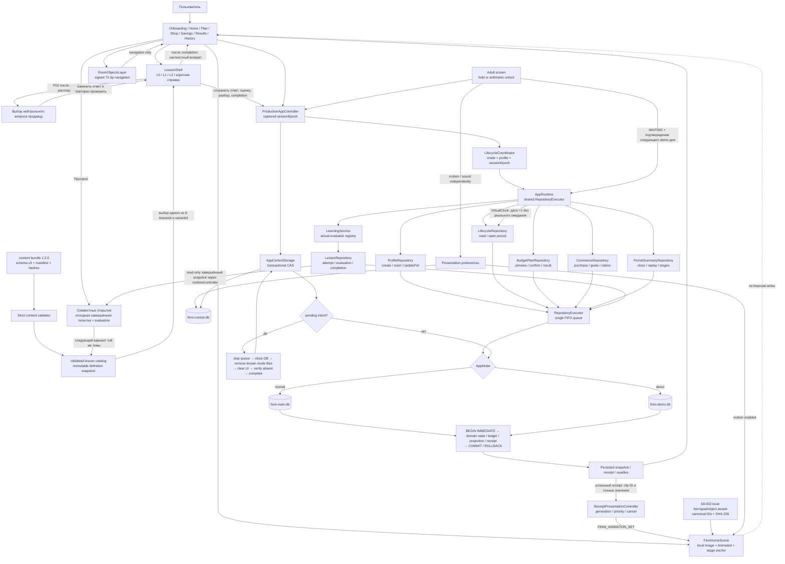
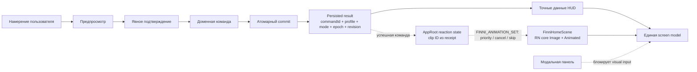

# ЛЦТ 2026 — общая схема workflow

Обновляйте диаграмму при изменении пользовательского flow, API/data flow,
state machine, background jobs, fallback/error paths или export/report flow.

## Покрытие по коду

- `Domain` → `Finni App/src/domain/contracts.ts` → `tests/domain.test.mjs`;
- `RepositoryExecutor` → `Finni App/src/persistence/repository-executor.ts` →
  `tests/persistence.test.mjs`;
- `Mode` и два файла → `Finni App/src/persistence/database.ts` →
  `tests/persistence.test.mjs`;
- транзакция, receipt и rollback →
  `Finni App/src/persistence/sqlite-repository.ts` →
  `tests/persistence.test.mjs`;
- schema/migrations → `Finni App/src/persistence/schema.ts`,
  `Finni App/src/persistence/migrations.ts` → `tests/persistence.test.mjs`.
- `NormalClock`/`VirtualClock` и state projection →
  `Finni App/src/domain/clocks.ts`, `Finni App/src/domain/lifecycle.ts` →
  `tests/lifecycle.test.mjs`;
- period/clock/revision transactions →
  `Finni App/src/persistence/lifecycle-repository.ts` →
  `tests/lifecycle.test.mjs`;
- epoch, mode switch и admin-intent recovery →
  `Finni App/src/application/app-control.ts`,
  `Finni App/src/application/lifecycle-coordinator.ts` →
  `tests/lifecycle-coordinator.test.mjs`.
- имя и 3×3 внешний вид → `Finni App/src/domain/pet-profile.ts` →
  `tests/profile-ui.test.mjs`;
- атомарный локальный профиль и повторная настройка →
  `Finni App/src/persistence/profile-repository.ts` →
  `tests/profile-ui.test.mjs`;
- normal-mode UI integration → `Finni App/src/application/app-runtime.ts` →
  `Finni App/src/ui/AppRoot.tsx`;
- schema-v3 bundle/manifest/validator → `Finni App/content/bundles/1.2.0`,
  `Finni App/src/content/validator.ts` → `tests/content-validation.test.mjs`;
- validated lesson snapshot, concrete B/P/S evaluators и demo-каталог →
  `Finni App/src/content/local-lesson-catalog.ts`,
  `Finni App/src/application/app-runtime.ts`, `Finni App/src/ui/LessonShell.tsx`
  → `tests/content-evaluator-integration.test.mjs`;
- attempt/evaluation/completion и единственная дневная награда →
  `Finni App/src/persistence/lesson-repository.ts` →
  `tests/lesson-persistence.test.mjs`, `tests/lesson-stability.test.mjs`;
- production 2D Home → `Finni App/src/ui/FinniHomeScene.tsx` →
  `tests/finni-home-scene.test.mjs`; 3D diagnostic runtime удалён S7-006;
- S8-001 stage/layer contract → `Finni App/src/ui/finni-layer-contract.ts`;
- S8-002 room/catalog binding → `Finni App/src/ui/RoomObjectsLayer.tsx`,
  `Finni App/src/ui/room-assets.ts` → `tests/room-assets.test.mjs`;
- S8-003 animation rules and persisted preferences →
  `Finni App/src/ui/finni-animation-set.ts`,
  `Finni App/src/ui/FinniHomeScene.tsx`,
  `Finni App/src/application/receipt-presentation.ts`,
  `Finni App/src/persistence/app-control-sqlite.ts` →
  `tests/finni-animation-set.test.mjs`,
  `tests/finni-presentation-preferences.test.mjs`;
- demo virtual clock / adult next-day → `Finni App/src/application/demo-scenario.ts`,
  `Finni App/src/application/app-runtime.ts`, `Finni App/src/ui/AdultScreen.tsx`
  → `tests/demo-runtime.test.mjs`;
- immutable initial plan, additions and plan/fact →
  `Finni App/src/persistence/budget-plan-repository.ts` →
  `Finni App/src/application/budget-plan-model.ts` →
  `Finni App/src/ui/BudgetPlanScreen.tsx` → `tests/budget-plan.test.mjs`;
- `ProductionAppController` и `LifecycleCoordinator` подключают mode/admin UI,
  memory-only adult access и recovery-before-open к production shell.

## Текущая layered 2D presentation-ветка

Схема относится к Accepted DEC-2026-09-19-006/007 и DEC-2026-09-21-008.
Core runtime, production controller и первый Home slice интегрированы;
presentation-polish остаётся scope Sprint 9.

- mode/admin flow подключён к отдельной control DB и recovery-before-open;
- commerce и period close используют единую очередь и atomic receipt;
- автоматизированный полный suite после S3 integration — 101/101;
- S2 emulator acceptance и S3-002 Android API 26 runtime четырёх B/P lessons
  закрыты; физические Android gates остаются в Sprint 10.

Анимация не вычисляет деньги, рост или стадию и не предшествует успешному
сохранению. При смене профиля, режима, `sessionEpoch`, навигации или reset
устаревшие presentation-события удаляются. Отключение движения заменяет эффект
статичным состоянием, но не меняет результат команды.
