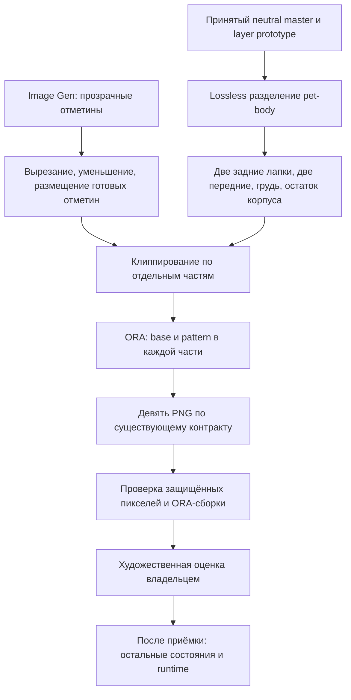
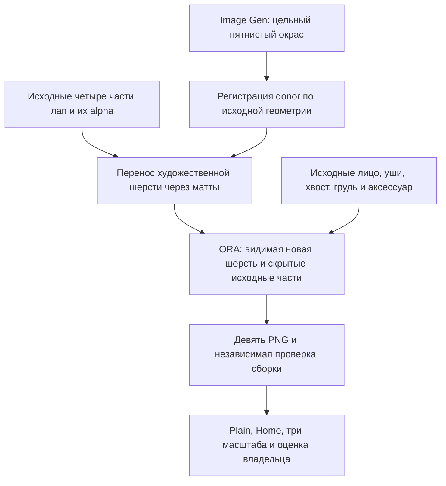

# S8-001: экспериментальный исходник окраса по анатомии

2026-09-25. Кандидат для art-review; runtime-контракт и принятие S7-004 неизменны.

Точная нейтральная сборка и отсутствие изменений за границами окраса проверены.
Скрытая анатомия для движения и принятие нового рисунка остаются открыты.

## Итерация v2 после отклонения веснушек

Для выразительного рисунка Image Gen создаёт цельно проработанную шерсть тела.
Полный generated character не принимается из-за дрейфа лица и масштаба.

Проверки v2: 0 alpha-разницы персонажа, 0 изменений вне маттов, восемь защищённых
экспортов побайтово исходные. Художественная приёмка и полная матрица не закрыты.
