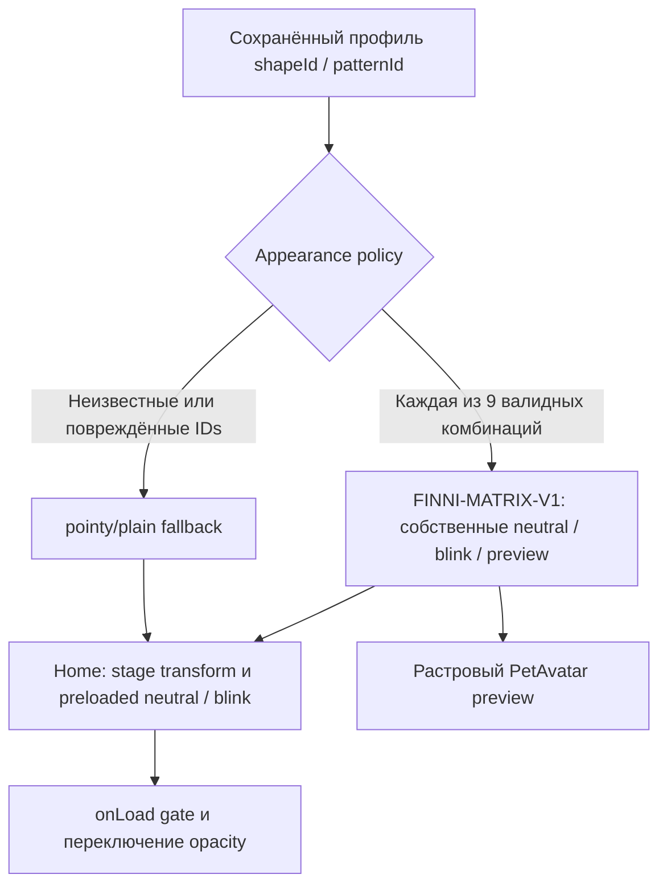

# S8-001 — выбор внешности в runtime

2026-09-25. Все9 combinations подключены; API26 debug UI sweep PASS. Pointy×3 и все окрасы приняты; round/floppy ear-fit-v2 ожидают художественной оценки владельца.

Persistence, экономика, domain IDs и transitions стадий не изменены. Контракт canvas941×1672, feet470/1272, stages .86/1/1.12. Девять ORA содержат neutral/blink stacks с девятью слоями каждый. Полная S8-001 ещё включает отдельные expression states и оставшиеся gates.

2026-09-25: художественно приняты все9внешностей ear-seams-v3; прежние pending-ear подписи исторические. Topology диаграммы не меняется. Остаток expressions и этапных проверок — S8-001.
