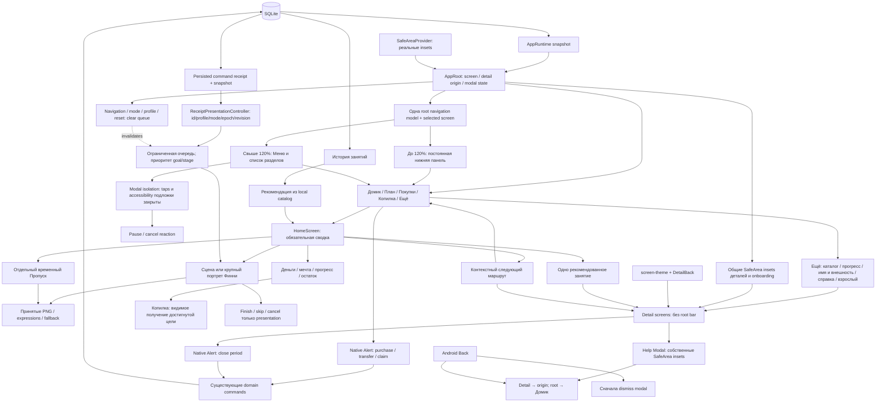

# S9-001: общая навигация и Home

Актуальная структура: DEC-2026-09-25-013, уточнение постоянной навигации.

Home и общая панель только открывают маршруты. Финансовое подтверждение выполняется внутри существующего экрана; панель не показывается поверх native Alert. Подписанные вкладки постоянны на пяти roots и отражают текущий экран; в крупном режиме используется тот же набор IDs списком. Незавершённая анимация не заменяет меню действием пропуска.

S9-002: реакция после покупки, перевода, цели, награды или смены стадии берётся из сохранённого receipt и нового snapshot. Вход в Home показывает ожидающий финансовый/стадийный эффект; награда занятия показывается на экране LessonShell из точного `before/after`, чтобы сохранить обычный маршрут возврата. Переход на иной маршрут уничтожает очередь или активный эффект. Finish/skip не вызывает команду и не изменяет сумму. Boot загружает snapshot без replay декоративных событий.

Обязательная сводка остаётся одновременно видна в 360×640/200%. CLOSED проверяется как presentation state; сохранённый закрытый период lifecycle проецирует в READY/WAITING. Новые bitmap assets и изменение экономики не требуются.

## S9-003/004: вложенные экраны

Каталог, пять типов учебных форм, история, редактор питомца, Adult и предварительный итог используют общую тёплую presentation-систему. `AppRoot` учитывает insets до рендера обычной детали; `Help` является отдельным native Modal со своей safe area. Loading/boot error используют самостоятельную safe area и ScrollView. `DetailBack` вызывает существующий callback возврата, не создаёт новый navigation stack.

После подтверждения закрытия периода приложение возвращается на Home; сохранённый итог читается в History. Ни финансовые команды, ни владение SQLite, ни последовательность confirmation/cancel этим пакетом не изменены. Недостижимые fallback/closed render branches не представлены как самостоятельные маршруты. Native evidence: `Finni App/artifacts/sprint-9/S9-003-004-details/README.md`.
