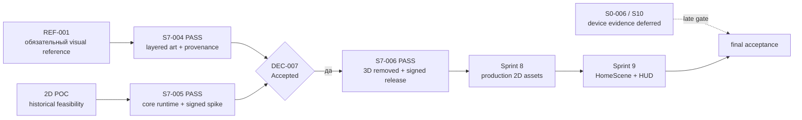

# Sprint 6–7 — переход на layered 2D gate

Схема фиксирует завершённые S7-004–S7-006 и Accepted
DEC-2026-09-19-006/007. Старый 3D gate сохранён в истории, но удалён из
runtime. Physical-device evidence остаётся в S0-006/S10.

Layered 2D presentation остаётся отдельным эффектом после persisted result:
анимация не вычисляет деньги, рост или lifecycle state. React Native HUD
остаётся источником точных данных и интеракций. POC не является принятием
production art/runtime; переход к S8 теперь открыт выполненными S7 gates.
