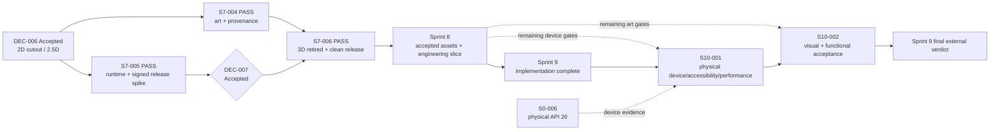

# Sprint 7–10 — layered 2D delivery gate

The 2D presentation branch remains downstream of persisted command results.
Sprint 10 starts from Sprint 9 implementation readiness; Sprint 9's final external
verdict follows Sprint 10 acceptance. Partial S9-001/003/004 reports retain the
unrun physical, TalkBack, performance and independent review criteria.
R1–R4, the 3D addendum and partial reports are retained as historical evidence;
they are not production dependencies after S7-006.
